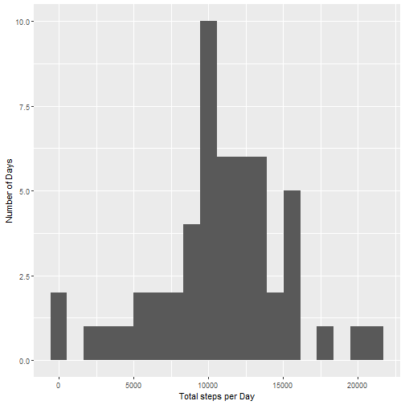
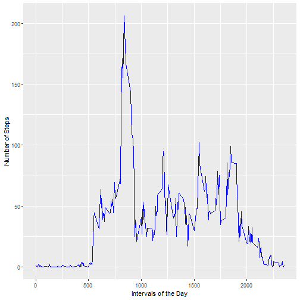
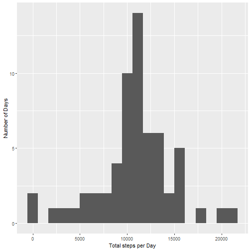
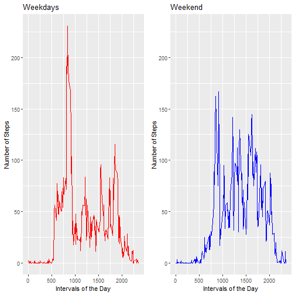

## Introduction

It is now possible to collect a large amount of data about personal movement using activity monitoring devices such as a Fitbit, Nike Fuelband, or Jawbone Up. These type of devices are part of the “quantified self” movement – a group of enthusiasts who take measurements about themselves regularly to improve their health, to find patterns in their behavior, or because they are tech geeks. But these data remain under-utilized both because the raw data are hard to obtain and there is a lack of statistical methods and software for processing and interpreting the data.

This assignment makes use of data from a personal activity monitoring device. This device collects data at 5 minute intervals through out the day. The data consists of two months of data from an anonymous individual collected during the months of October and November, 2012 and include the number of steps taken in 5 minute intervals each day.

The data for this assignment can be downloaded from the course web site:

Dataset: [Activity monitoring data](https://d396qusza40orc.cloudfront.net/repdata%2Fdata%2Factivity.zip) [52K]
The variables included in this dataset are:

- **steps:** Number of steps taking in a 5-minute interval (missing values are coded as <span style="color:red">NA</span>)
- **date:** The date on which the measurement was taken in YYYY-MM-DD format
- **interval:** Identifier for the 5-minute interval in which measurement was taken


## 1. Loading and preprocessing the data

The dataset is stored in a comma-separated-value (CSV) file and there are a total of 17,568 observations in this dataset.


```r
data <- read.csv("activity.csv", header = TRUE)
summary(data)
```

```
##      steps                date          interval     
##  Min.   :  0.00   2012-10-01:  288   Min.   :   0.0  
##  1st Qu.:  0.00   2012-10-02:  288   1st Qu.: 588.8  
##  Median :  0.00   2012-10-03:  288   Median :1177.5  
##  Mean   : 37.38   2012-10-04:  288   Mean   :1177.5  
##  3rd Qu.: 12.00   2012-10-05:  288   3rd Qu.:1766.2  
##  Max.   :806.00   2012-10-06:  288   Max.   :2355.0  
##  NA's   :2304     (Other)   :15840
```

We can see that there are 2304 missing values in the step variable and there are 288 observations per day.

Let's change date format from factor to Date.


```r
data$date <- as.Date(data$date, "%Y-%m-%d")
summary(data)
```

```
##      steps             date               interval     
##  Min.   :  0.00   Min.   :2012-10-01   Min.   :   0.0  
##  1st Qu.:  0.00   1st Qu.:2012-10-16   1st Qu.: 588.8  
##  Median :  0.00   Median :2012-10-31   Median :1177.5  
##  Mean   : 37.38   Mean   :2012-10-31   Mean   :1177.5  
##  3rd Qu.: 12.00   3rd Qu.:2012-11-15   3rd Qu.:1766.2  
##  Max.   :806.00   Max.   :2012-11-30   Max.   :2355.0  
##  NA's   :2304
```

## 2. Histogram of the total number of steps taken each day

First, we must sum-up the steps for each day.


```r
sum <- as.data.frame(tapply(data$steps,data$date,sum))
names(sum) <- "stepsDay"
```

Now we plot the histogram.


```r
library(ggplot2)
ggplot(sum, aes(stepsDay)) + geom_histogram(bins = 20) + ylab("Number of Days") + 
    xlab("Total steps per Day")
```

```
## Warning: Removed 8 rows containing non-finite values (stat_bin).
```



## 3. Mean and median of steps taken each day

Calculate and report the mean and median of the total number of steps taken per day


```r
mean(sum$stepsDay, na.rm = TRUE)
```

```
## [1] 10766.19
```

```r
median(sum$stepsDay, na.rm = TRUE)
```

```
## [1] 10765
```

## 4. Time series plot of the average number of steps taken

we have to calculate the mean number of steps taken in each 5-minute interval, across all days.


```r
mean <- as.data.frame(tapply(data$steps, data$interval, mean, na.rm = TRUE))
names(mean) <- "meanSteps"
```

Now we plot the result to see if there is an average daily activity pattern.
5-minute interval (x-axis) and the average number of steps taken, averaged across all days (y-axis)


```r
ggplot(mean,aes(as.numeric(rownames(mean)),meanSteps)) + geom_line(color="blue") + 
    ylab("Number of Steps") + xlab("Intervals of the Day")
```



## 5. 5-minute interval with the maximum steps

Which 5-minute interval, on average across all the days in the dataset, contains the maximum number of steps?


```r
rownames(mean)[mean == max(mean)]
```

```
## [1] "835"
```

## 6. Code to describe and show a strategy for imputing missing data

We already show there are 2304 missing values in the step variable. Let's check again.


```r
sum(is.na(data$steps))
```

```
## [1] 2304
```

We will fill in the missing values by introducing the average for that 5-minute interval.


```r
mean$interval <- as.numeric(rownames(mean))
data2 <- merge(data, mean, by = "interval")
for (i in 1:nrow(data2))
{
    if(is.na(data2$steps[i])){
        data2$steps[i] <- data2$meanSteps[i]
    }
}
```

Now, there are no missing values:

```r
sum(is.na(data2$steps))
```

```
## [1] 0
```

## 7. Histogram of the total number of steps taken each day after missing values are imputed

we create the same plot that in step 2 to see the influence of NAs.


```r
sum2 <- as.data.frame(tapply(data2$steps,data2$date,sum))
names(sum2) <- "stepsDay"

ggplot(sum2, aes(stepsDay)) + geom_histogram(bins = 20) + ylab("Number of Days") + 
    xlab("Total steps per Day")
```



We can see that the number of days per bin has increased but the shape is mostly the same.

Let's check if the mean and median have changed:

```r
mean(sum2$stepsDay)
```

```
## [1] 10766.19
```

```r
median(sum2$stepsDay)
```

```
## [1] 10766.19
```

the mean is exactly the same, the median has increased a little, but it can be neglected.

## 8. Panel plot comparing the average number of steps taken per 5-minute interval across weekdays and weekends

First, we create a new factor variable in the dataset with two levels – “weekday” and “weekend” indicating whether a given date is a weekday or weekend day.


```r
data2$day <- weekdays(data2$date)
library(mgsub)
data2$day <- mgsub(data2$day,c("lunes","martes","miércoles","jueves","viernes"),rep("weekday",5))
data2$day <- mgsub(data2$day,c("sábado","domingo"),rep("weekend",2))
data2$day <- as.factor(data2$day)
table(data2$day)
```

```
## 
## weekday weekend 
##   12960    4608
```

We calculate again the averages, now by weekdays and weekends.


```r
data2$meanSteps <- NULL
mean2 <- as.data.frame(tapply(data2$steps, list(data2$interval,data2$day), mean))
mean2$interval <- as.numeric(rownames(mean2))
```

Now we plot the result to see if there is an average daily activity pattern difference between weekdays and weekends.


```r
library(gridExtra)
rng <- range(mean2$weekday,mean2$weekend)
g1 <- ggplot(mean2, aes(interval,weekday)) + geom_line(color="red") + ylim(rng) +
    ylab("Number of Steps") + xlab("Intervals of the Day") + ggtitle("Weekdays")
g2 <- ggplot(mean2, aes(interval,weekend)) + geom_line(color="blue") + ylim(rng) + 
    ylab("Number of Steps") + xlab("Intervals of the Day") + ggtitle("Weekend")
    
grid.arrange(g1, g2, nrow=1, ncol=2)
```



We conclude there is significant diference in activity patterns during weekdays and weekends.


